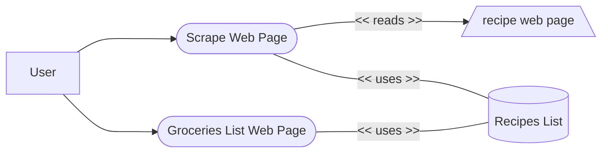
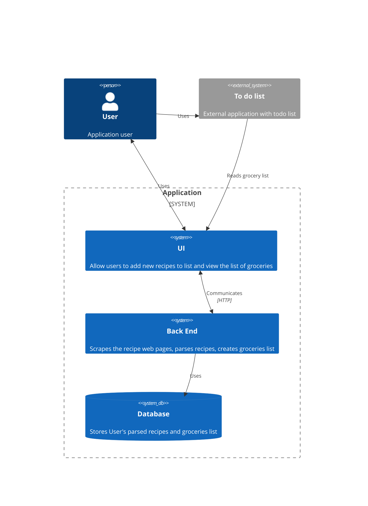

# Recipes Scraper technical docs
- [Recipes Scraper technical docs](#recipes-scraper-technical-docs)
  - [Abstract](#abstract)
  - [Use cases](#use-cases)
    - [1.0 Add a recipe](#10-add-a-recipe)
    - [2.0 Display groceries list](#20-display-groceries-list)
  - [Architecture](#architecture)

## Abstract

The following document describes technical and architectural design of the application.

## Use cases
### 1.0 Add a recipe
1. User opens add recipe page
2. Application displays a page with a textfield for recipe url and `Add recipe` button
3. User puts the recipe url in the textfield and clicks on the `Add recipe` button
4. Application scrapes the web page under the url from the textfield
5. Application saves the scraped recipe in the recipes list assigned to the user
### 2.0 Display groceries list
1. User opens the groceries page
2. Application displays a page containing a parsed list of groceries
3. User reads the groceries list

## Architecture
Mermaid diagrams describing the architecture to be added available below

